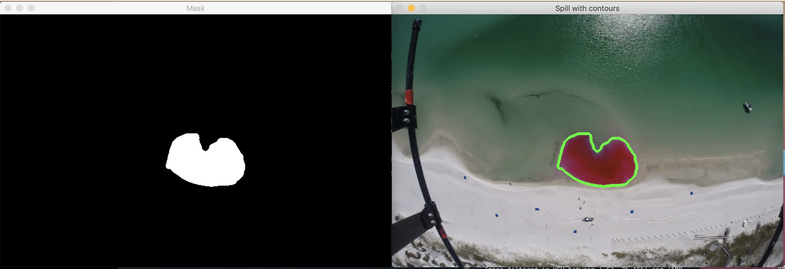

# track-the-surf
Tool for tracking blobs in the surfzone using computer vision. 

## tl;dr
Sequential images are resized, stitched together into video clips and stabilized. Computer vision techniques are then applied to the videos to track the blob progression over time. Properties of the blob may be extracted for use as input in a predictive machine learning model, including contour values and image pixel  density. 

## Prepping the images
Drone imagery collected during the [SCOPE](http://carthe.org/scope/) field experiment and georectified by [Brouwer et al. 2015](https://doi.org/10.1175/JTECH-D-14-00122.1) make up the preliminary data for this project. Images were  compiled  in  the  chronological  order  they  were  captured  and  stitched together  into  a  movie  to  observe  the  dispersion  rates  and  patterns  of  the spill.  This was completed in a series of steps:

- (1) Using `ffmpeg`, the images were stitched together into a movie to show the growth of the spill using this command:  
```
ffmpeg -f image2 -s 1000x750 -i img-%04d.JPG -vcodec libx264 -crf 25 -pix_fmt yuv420p SCOPEraw.mp4
```
where `SCOPEraw.mp4` is the output movie file. Because two UAVs were used, the resulting movie was discontinuous at the points when the drones were swapped out.  For this reason, the video was manually split into 6 batches of continuous footage. 

- (2) After reviewing and splitting the movie into batches, the command below decreased the file size of each image from 12MP (4000×3000 pixels) to 3MP (2000×1500pixels) in order to stabilize the videos in a shorter period of time. This process also reduces the size and time required to process the video data with computer vision techniques, to follow.
```
ffmpeg -i img-%04d.JPG -vf scale=2000:1500 output-%04d.jpg
```

- (3) For each batch of images, `ffmpeg` was used to renumber the images beginning with *0001* before processing the images and rendering them as movies, as this is the default starting index for image processing with `ffmpeg`. A total of 6 continuous movies were generated,  each built from about 200 high-resolution sequential images. The file sizes of the generated *.mp4* movie files ranged from 7.3MB to 19.4MB. The following code runs through the images in a batch and renumbers them, so the images of each batch are numbered from *0001*:
```
#!/bin/bash
a=1
for file in *.jpg
    do
        new=$(printf "output-%04d.jpg" "$a")
        mv -i -- "$file" "$new"
        let a=a+1
    done
```
Then each continuous batch of images was rendered as a movie:
```
ffmpeg -f image2 -s 1000x750 -i output-%04d.JPG -vcodec libx264 -crf 25 -pix_fmt yuv420p batch1.mp4
```

- (4) A video-stabilization tool was used to identify reference points and transform these images into smooth time lapse videos. This was achieved using `Vid.stab` plugged-in with `ffmpeg`. This step was required as the library of raw images, when stitched together, came out unstable and shaky due to being captured by drone imagery. `Vid.stab` targets control points from the images to help create a smoother, more stabilized movie. To produce a stabilized output video file, the code below identifies the transformations that must occur to stabilize the video, and applies them with the second command:
```
ffmpeg -i batch1.mp4 -vf vidstabdetect -f null -
ffmpeg -i batch1.mp4 -vf vidstabtransform=smoothing=5:input="transforms.trf" batch1-stabilized.mp4
```
A side-by-side comparison of the original and stabilized videos can be created with this command (found on a forum [here](http://ffmpeg-users.933282.n4.nabble.com/Merge-two-videos-into-one-with-side-by-side-composition-td4659527.html)):
```
ffmpeg -i batch1.mp4 -i batch1-stabilized.mp4 -filter_complex "[0:v:0]pad=iw*2:ih[bg]; [bg][1:v:0]overlay=w" compare1.mp4
```
The following script stitches the batched films together into one video, joining all the *.mp4* files in the current folder into *joined-out.mp4*:
```
#!/bin/bash

[ -e list.txt ] && rm list.txt
for f in *.mp4
do
   echo "file $f" >> list.txt
done

ffmpeg -f concat -i list.txt -c copy joined-out.mp4 && rm list.txt
```
This script was run for both the stabilized and non-stabilized videos:
```
bash ./stitch-vids.sh
```
*Notes: `.` refers to the current directory, where the script was saved in this case. If the script is saved elsewhere, replace `.` with `/path/to/yourscript.sh` as seen [here](https://askubuntu.com/a/38670). `bash` was added in to give execute permission to the script.*

Finally, a side-by-side comparison can be generated to view the full original and full stabilized videos:
```
ffmpeg -i joined-out.mp4 -i joined-out-stab.mp4 -filter_complex "[0:v:0]pad=iw*2:ih[bg]; [bg][1:v:0]overlay=w" compare-full.mp4
```
## Filtering for a specific color range
Images are described in an HSV color space to segment the spill from the background using the object's hue values. OpenCV's Trackbar function was used to find a suitable range of hue values. First, the trackbar window should be created:
```
cv2.namedWindow("Trackbars")
```
and then trackbar sliders were created for the minimum and maximum values for hue, saturation, and value:
```
cv2.createTrackbar("H_MIN", "Trackbars", 63, 180, nothing)
cv2.createTrackbar("H_MAX", "Trackbars", 109, 180, nothing)
cv2.createTrackbar("S_MIN", "Trackbars", 35, 255, nothing)
cv2.createTrackbar("S_MAX", "Trackbars", 255, 255, nothing)
cv2.createTrackbar("V_MIN", "Trackbars", 165, 255, nothing)
cv2.createTrackbar("V_MAX", "Trackbars", 255, 255, nothing)
```
## Segment the image
Once a satisfactory range was set for the mask, the dye plume was able to be segmented in a series of steps:
```
# set range of HSV values
lowerBound = np.array([63, 20, 165])
upperBound = np.array([109, 255, 255])

# stream video file
cam = cv2.VideoCapture("/Users/espeon/spyder3-py3/joined-out-stab.mp4")
kernelOpen = np.ones((5, 5))
kernelClose = np.ones((20, 20))

# loop through frames
while(cam.isOpened()):
    ret, original = cam.read()
    
    # resize image
    original = cv2.resize(original, (680,440))
    
    # invert image since reds wrap around 0 and 360
    img = (255-original)
    
    # convert BGR to HSV and blur w.r.t. edges
    imgHSV = cv2.cvtColor(img, cv2.COLOR_BGR2HSV)
    blur = cv2.bilateralFilter(imgHSV,10,300,300)
    
    # create mask
    mask = cv2.inRange(blur, lowerBound, upperBound)
    maskOpen = cv2.morphologyEx(mask, cv2.MORPH_OPEN, kernelOpen)
    maskClose = cv2.morphologyEx(maskOpen, cv2.MORPH_CLOSE, kernelClose)
    maskFinal = maskClose
```
As an improvement, a region of interest (ROI) was incorporated to ignore any noise outside the spill, in particular some red tape affixed to the drone in the video frames. The new mask is then created:
```
    # ROI
    black = np.zeros((img.shape[0], img.shape[1], 3), np.uint8) #---black in RGB
    black1 = cv2.rectangle(black,(200,70),(500,350),(255, 255, 255), -1) #-----ROI
    gray = cv2.cvtColor(black,cv2.COLOR_BGR2GRAY)
    ret,b_mask = cv2.threshold(gray,127,255, 0) #----converted to binary
    fin = cv2.bitwise_and(b_mask,b_mask,mask = mask) #-----ROI mask
```
## Contours
After the spill is segmented, the contours at each frame may be ontained. The contours are valuable in order to quantify the development of the spill over time. The OpenCV findContours function was used to extract the contours of the spill in the binary image: 
```
    contours =  cv2.findContours(fin,cv2.RETR_EXTERNAL,cv2.CHAIN_APPROX_SIMPLE)[-2]
```
Then, the contours are drawn onto each video frame using the OpenCV function drawContours. 
```
# loop over the contours
    for c in contours:
        area = cv2.contourArea(c)
        if area>150: # ignore anomalies
            cv2.drawContours(original, [c], -1, (0,255,0), 3)
            
    cv2.imshow("Mask", fin)
    cv2.imshow("Spill with contours",original)
```


Properties of the dye spill may be extracted simply now, such as pixel density, area, and the contour pixel values. This can be seen in the code, and was accomplished by appending areas, contour values, and pixels within the contours into previously initialized matrices at each step looping through the frames. 
